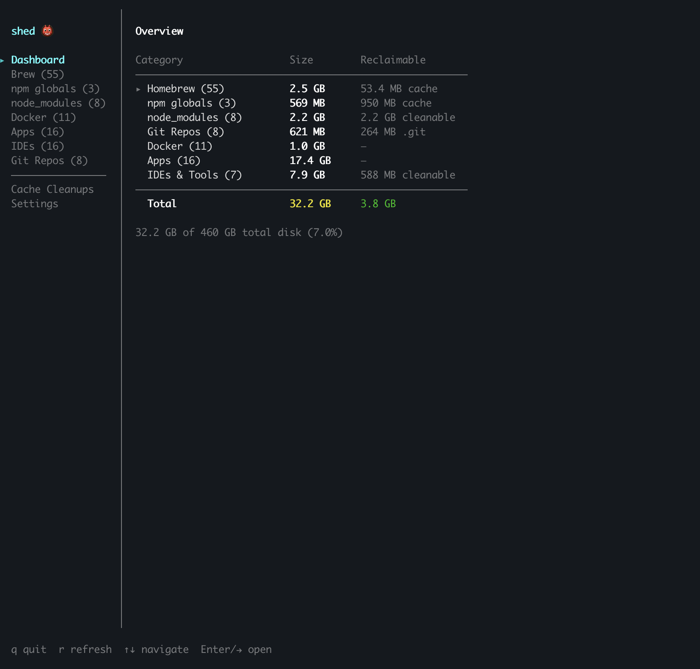
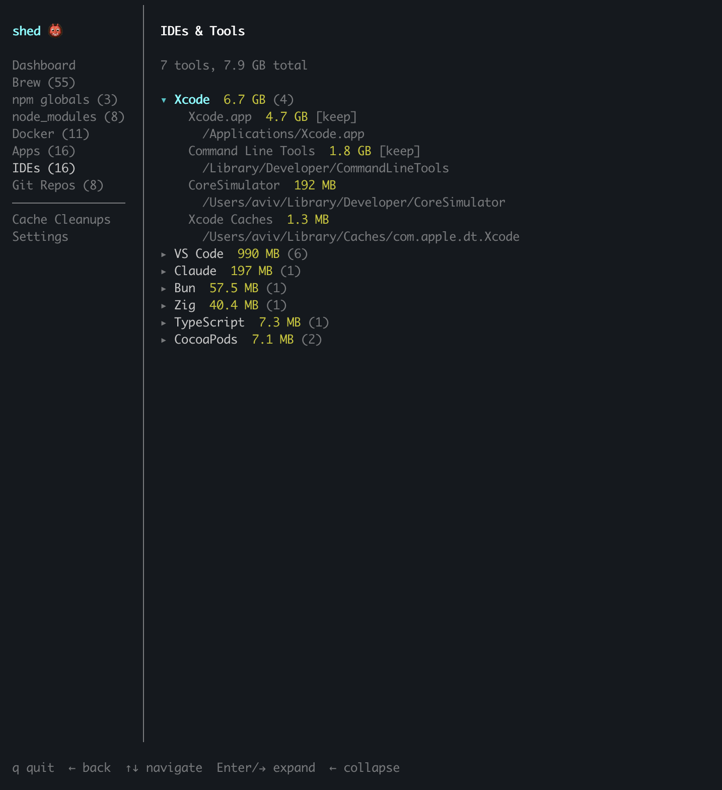
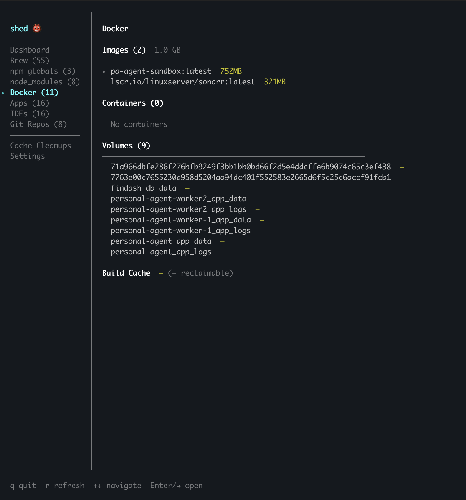
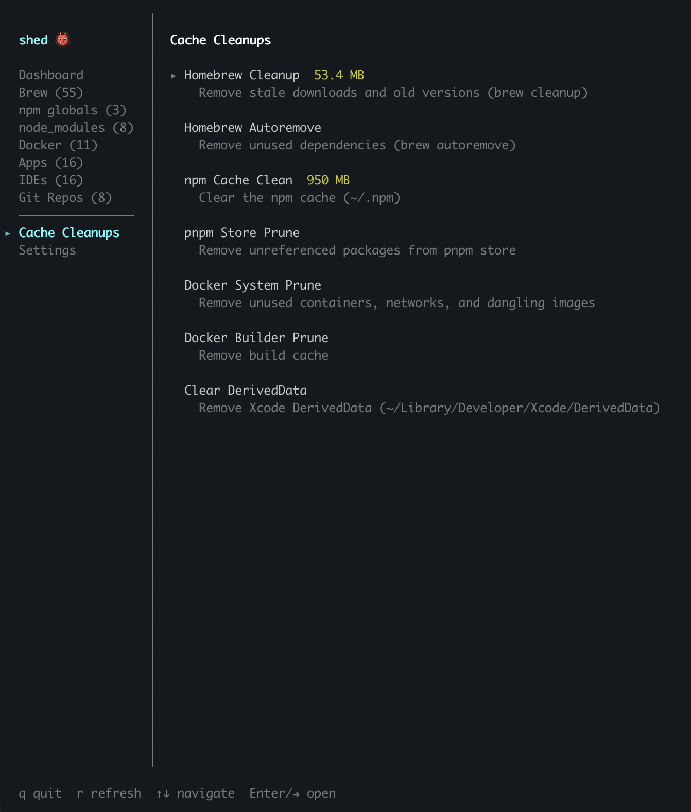

# shed 👹

*Your disk storage is haunted by dev tools. Exorcise them.*

**shed** is an interactive terminal tool that finds everything dev-related eating your disk — Homebrew, npm, Docker, node_modules, IDEs, git repos — and lets you clean it up on the spot.



## What it shows

- **Homebrew** — every formula with size, dependency status, and which of your projects use it
- **npm globals** — globally installed packages with project links
- **node_modules** — every `node_modules` directory across your projects, expandable to show individual packages
- **Docker** — images, containers, volumes, and build cache with project links (auto-detects compose projects)
- **Apps** — `/Applications` sorted by size
- **IDEs & Tools** — VS Code, Xcode, Claude, Zig, Bun, CocoaPods, and more, grouped by tool
- **Git Repos** — all repos found on disk with `.git` size breakdown
- **Cache Cleanups** — one-click actions for brew cleanup, npm cache clean, docker prune, and more (with impact warnings)
- **Settings** — configure git scan paths and depth levels, persisted across sessions

Everything is interactive: navigate with arrows, expand with Enter/→, and delete with confirmation. Cleanup actions show a warning about the impact (e.g., "Next build will be slower") before running.

| | |
|---|---|
|  |  |
|  | |

## Install

```bash
npm install -g shed
```

Or for local development:

```bash
git clone https://github.com/aviv1993/shed.git
cd shed
pnpm install
pnpm build && npm link
```

## Development

```bash
pnpm install        # install dependencies
pnpm dev            # run the TUI with tsx
pnpm test           # run tests
pnpm test:watch     # run tests in watch mode
pnpm typecheck      # check types
pnpm build          # compile to dist/
```

## Navigation

| Key | Action |
|-----|--------|
| `↑/↓` or `j/k` | Navigate items |
| `←/→` or `Tab` | Switch between sidebar and content |
| `Enter` or `→` | Expand/collapse groups, open details |
| `Del` or `Backspace` | Delete selected item (with confirmation) |
| `r` | Refresh all data |
| `q` or `Ctrl+C` | Quit |

## Configuration

shed stores settings in `~/.config/shed/config.json`. You can configure:

- **Git scan paths** — directories to scan for git repos, each with a configurable depth level (1–5)

Access settings from the sidebar's "Settings" tab. Default behavior scans `~/` at depth 3, matching all subdirectories under your home folder.
